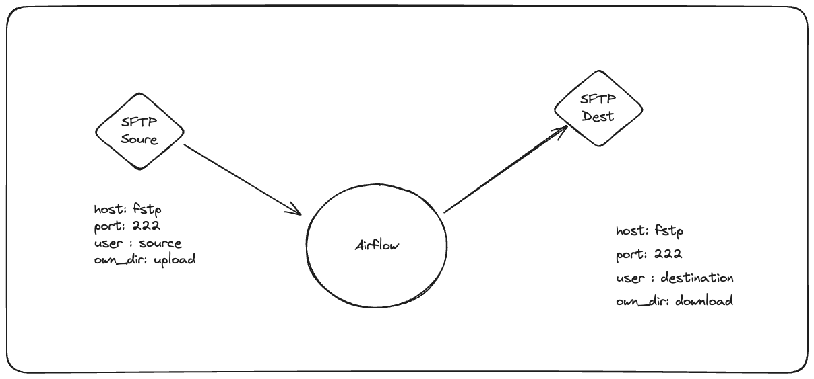
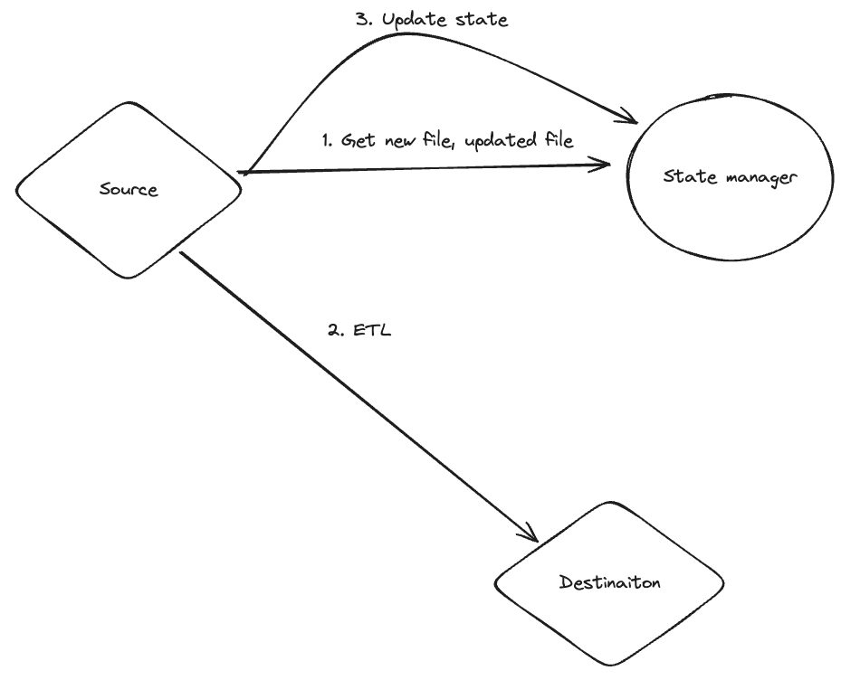

# Cake Home Assignment - ETL SFTP Servers

## Overview

Vu's assignment to build data pipeline to extract data from SFTP servers, transform the data and load it into destination SFTP servers.

## Deployment 

**Need locate on repo path before run all below commands**

### 1. Gen SSH key
Because I deploy SFTP server on docker, so I need to generate SSH key 
avoid MITM warning when recreate container (and the host keys changes)
so must own the private key and public key. **Note**: create with empty passphrase for the key
```bash
ssh-keygen -t ed25519 -f ssh_host_ed25519_key < /dev/null
ssh-keygen -t rsa -b 4096 -f ssh_host_rsa_key < /dev/null
```

### 2. Docker compose
```bash
docker-compose up
```

### 3. Run Sftp_sync dag

I have 2 SFTP servers, one for source and one for destination 
(actually they are the same server but different  user)


Steps:
- Go to Airflow UI at http://localhost:8080 with username and password is `airflow`
- Turn and trigger on the `sftp_sync` dag
- Connect and put file to source SFTP server:
  -  Run `sftp -oPort=2222 source@localhost` with password is `src`
  - Cd to `upload` folder and put file 1.txt in my repo to this folder by `put 1.txt` command
- Check the destination SFTP  server (`sftp -oPort=2222 destination@localhost` with password is `dst`,  go to dir `donwload`) to see the file is copied to this server 
(I schedule to run every 3 minutes so you need to wait a little bit)

**Note:** Connection source and dest SFTP have been created when deploy docker-compose

## Explain the pipeline

### 1. Design


This design is simple, I have 3 tasks: 
1. Detect all new files or modified files in the source by state management
2. Execute ETL workflow
3. Update the last modified time in the database as state, use this state in the next run

It has advantages is idempotent, but it required to manage state properly.

### 3. The abstraction
Source or Destination not only SFTP server, it can be any storage file  like GCS, AWS S3, etc. So I have to define the interface for the source and destination. 
```python
class Source:
  def get_files(self, path):
    ...
    
  def get_mod_time(self, file_path):
    ...

  def get_pay_load(self, file_path):
    ...

  def get_new_files(self, path):
    ...

```

### 4. Easily custom transform
Custom transformations is needed in pipeline, so I have defined the interface for the transformation  whereas its implementations can be interchangeable

Trade-off: I assume that there is no needed for joining transformation (i.e aggregation between data entities) as SFTP servers usually offer unstructured data, so only on-the-fly transformation is supported

### 5. Handle abnormal file size
I have two options to process data from source to destination:
1. Process as normal:  read all content of files and write to destination
   - Pros: simple, easy to implement
   - Cons: if the file is too large, it can cause memory error
2. Make a streaming pipelines by chunking single file into small pieces
   - Pros: can handle large file by saving memory usage.
   - Cons: complex, exception handling , IO pressure.
